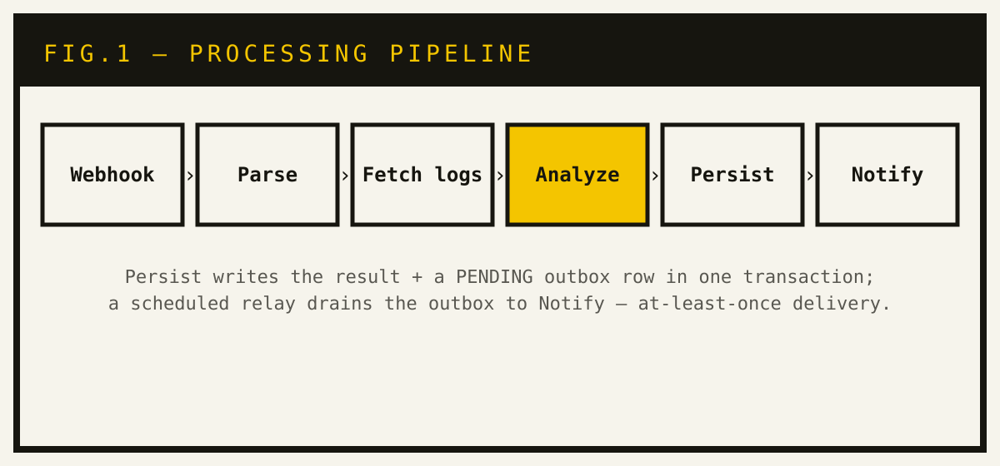

## Problem

CI fails. Someone on call opens a 4,000-line log and guesses. The guessing is
mechanical: pull the failed job's logs, classify the failure, say what broke,
tell the right channel. Same steps, every time.

So I built that part as a real backend service. It was also a good excuse to
work through the patterns this kind of service forces on you: pluggable inputs,
an external call that can fail, durable storage, a notification that can't get
lost.

## Approach

Spring Boot, Java 21, **ports and adapters**. A pure `core` module holds the
domain — `BuildEvent`, `BuildLog`, `AnalysisResult` — and five ports:
`WebhookParser`, `BuildLogFetcher`, `FailureAnalyzer`, `Notifier`,
`AnalysisResultStore`. No framework in the core. The `app` module supplies the
Spring adapters. The orchestration is testable in plain JUnit; every piece swaps
independently.

A CI provider POSTs to `/webhook/{provider}`. One pipeline handles it:

- **Providers by strategy.** The orchestrator asks each `WebhookParser`
  `supports(provider)` and takes the first yes. GitHub Actions and Buildkite
  today. A new provider is a new parser; the flow doesn't change.
- **Log fetch, retried.** The GitHub API call is the only one that leaves the
  process. Resilience4j `@Retry` wraps it.
- **Analysis behind a port.** `FailureAnalyzer` returns a category, a root
  cause, a summary. A deterministic stub runs the whole pipeline locally with
  zero external calls; an LLM-backed adapter drops into the same port.
- **Transactional outbox.** One transaction writes the result row and a
  `PENDING` outbox row. A scheduled relay drains the outbox, marks rows `SENT`,
  counts attempts. Notifier down? The notification waits — it doesn't vanish.
  At-least-once delivery, decoupled from the request.
- **Two stores, one port.** `AnalysisResultStore` has a Google Cloud Datastore
  adapter and a DynamoDB adapter; a Spring profile picks one. Datastore does the
  outbox write. DynamoDB is the lean path the AWS deployment uses.
- **Authenticated edges.** GitHub webhooks get a constant-time HMAC-SHA256
  check before anything runs. `/results` sits behind stateless basic auth with a
  mandatory password — the app refuses to start with a guessable one.

Ships as a multi-stage Docker image. Runs on AWS. The Terraform is two stacks: a
durable `base` (ECR, DynamoDB, SSM secrets, and a cost budget with a hard deny
action) at near-zero idle cost, and an ephemeral `ecs` stack — IAM roles,
Fargate task definition, service — brought up and torn down per session, so
compute only bills while it's up. No static keys in the container: the task role
grants scoped DynamoDB access, and a separate execution role pulls the image and
decrypts secrets at launch.

## Result

A small backend where every pattern is load-bearing: a framework-free core, a
strategy seam for providers, a retry around the one fault-prone call, an outbox
that makes delivery durable instead of best-effort. The store port is exercised
by two real adapters on two clouds. Both edges are authenticated. It deploys to
Fargate from Terraform with least-privilege IAM and a cost guardrail. Unit and
integration tests cover the orchestration, the retry path, signature
verification, and both stores.
