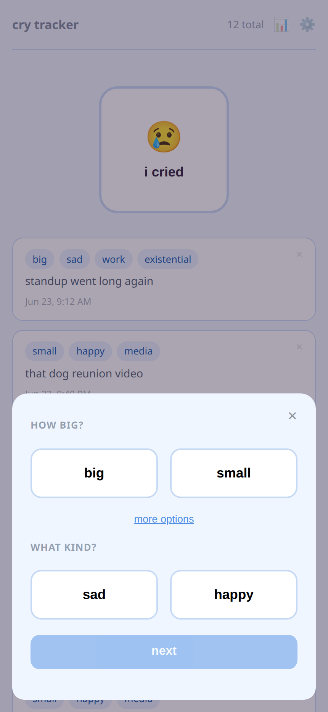
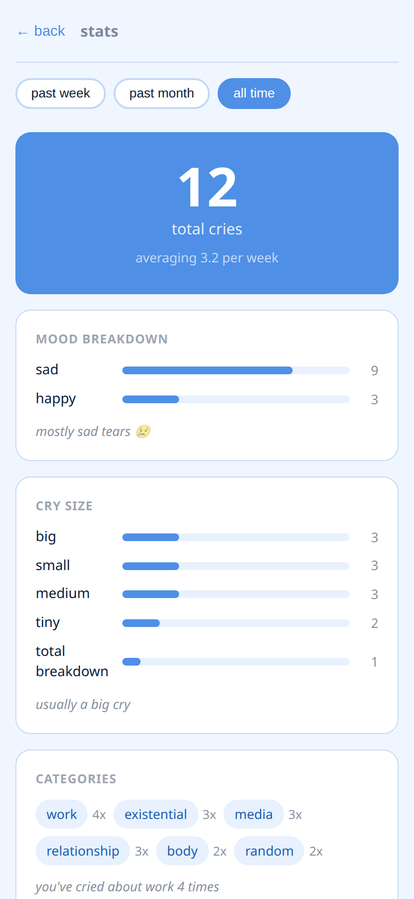

## Problem

I wanted a small, honest personal tracker — one tap to log a cry, then enough
structure on top to actually see a pattern. How big was it, was it a happy or a
sad cry, what set it off, and the occasional note. The point was never the data
entry; it was the payoff: a mood breakdown, a size distribution, the recurring
triggers, and a streak. It only ever needs to serve one person, so the real
constraint was keeping the whole thing tiny and cheap to run while still being a
real app — authenticated, persistent, and deployed — rather than a toy that lives
in `localStorage`.

## Approach

It's an npm-workspaces monorepo with two halves: a **Svelte 5 SPA** for the UI and
a **Hono API on Cloudflare Workers** backed by **Cloudflare D1** (SQLite) for
everything else. The SPA ships as a static bundle; all state lives in D1 behind
the Worker, and the only thing the browser persists is a bearer token in
`localStorage`.

- **PIN gate, not accounts.** Single-user means the auth can be a numeric PIN
  exchanged for a session token, with per-IP rate limiting (5 attempts / 15 min)
  backed by an `auth_attempts` table. The PIN lives in a Worker secret binding,
  never in committed source — the test suite uses its own fixed test-only PIN.
- **Data the app can reshape.** The selectable label lists — sizes, valences,
  triggers — aren't hardcoded enums. They live in a `config` table and are
  editable in Settings, so the vocabulary of the app is itself data.
- **Stats as the product.** The cries table is deliberately flat (no foreign
  keys), which keeps the aggregation queries — mood split, size distribution,
  trigger frequency, streaks — simple and fast.

## Result

The outcome is a complete, deployed app that does exactly one thing well and
costs almost nothing to keep running: a static Svelte front end and a Hono Worker
on Cloudflare's free tier. The API surface is small and fully covered by
integration tests using `@cloudflare/vitest-pool-workers` — auth, the cries CRUD
flow, and config — so the contract is verified against a real Workers runtime
rather than mocked. Auth is rate-limited and secrets stay out of the repo, and
the label lists are user-editable, so the app bends to how its one user actually
thinks about crying instead of forcing them into my categories.
