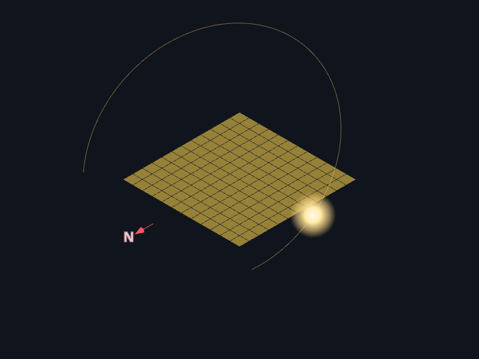
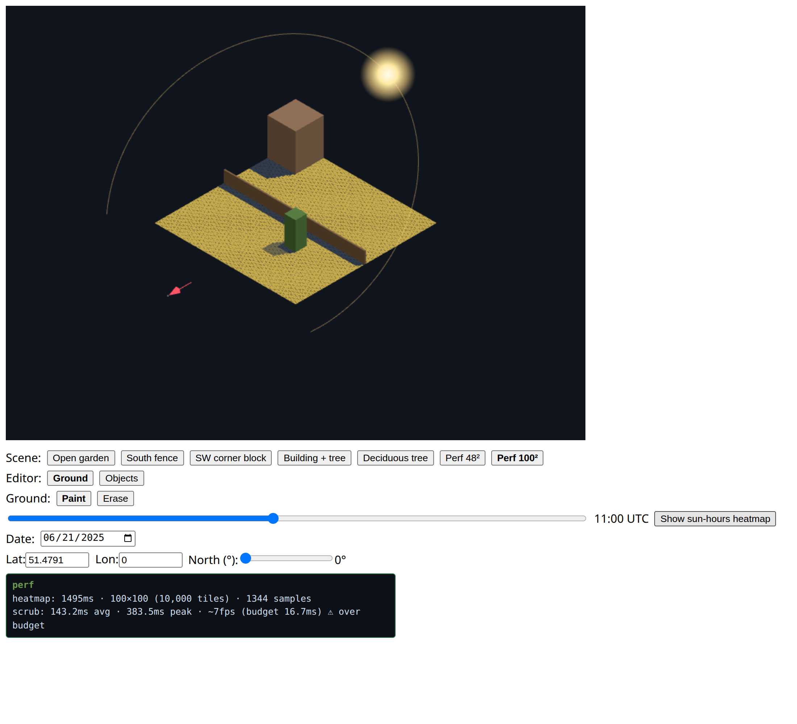

## Problem

Before you plant anything, you want to know where the sun actually falls — and
that's surprisingly hard to eyeball, because it changes hour to hour and month to
month as buildings, fences, and trees throw shadows that move. I wanted a tool
where you lay out a real garden as a grid of tiles, drop in the things that block
light, and then *see* the sun: scrub the time of day to watch shadows sweep
across the plot, or aggregate an entire season into a **sun-hours heatmap** that
tells you the sunniest and shadiest spots at a glance. The interesting
engineering problem underneath was keeping a real-time 3D simulation responsive
while it does a genuinely heavy amount of solar math.

## Approach

The architecture is a **pure simulation core behind ports**, with swappable
adapters at the edges. The core — the garden model, the tiles, the
shadow-and-sun-hours math — has no DOM or engine dependencies and is headlessly
testable in plain Vitest. The adapters plug into the ports: a **Three.js**
orthographic renderer for the isometric view, a **SunCalc**-backed provider for
real solar positions at a given latitude and date, and a **Web Worker** for the
expensive seasonal aggregation. The domain language and the decisions behind the
seams are written down in the repo's `CONTEXT.md` and `docs/adr/`.

- **Two views of the same model.** An instantaneous mode (scrub time, watch one
  moment) and an aggregated mode (sum sun-hours over a season into a heatmap)
  read from the same core — the renderer just visualizes whatever the core
  computes.
- **The heavy math runs off the main thread.** Aggregating a season across
  thousands of tiles is the bottleneck, so it lives in a Web Worker and never
  blocks the interaction.

## Result

The app holds **60fps at its design ceiling** — a ~100×100, 10,000-tile garden —
both while scrubbing the time of day and while a season's heatmap computes.
Getting there meant clearing two specific bottlenecks: moving the seasonal
aggregation off the main thread into the Web Worker, and switching the tile grid
from one mesh per tile to a single `InstancedMesh`. The ports-and-adapters split
paid off twice — the solar math is verified headlessly without spinning up a
renderer, and the whole performance story (prior state, diagrams, the actual
fixes) is documented because the bottlenecks lived in identifiable, swappable
pieces rather than smeared across the render loop.

