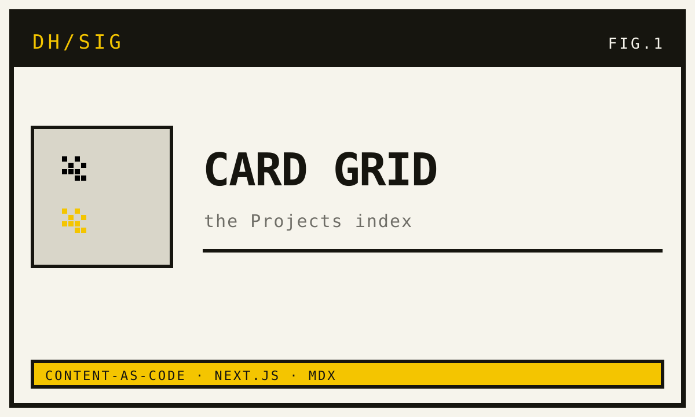

## Problem

I needed a portfolio that credibly shows what I build — not a single static
landing page whose links go nowhere, but real **Projects**, each with a clean,
shareable URL. The site itself should also stand as a piece of engineering.

## Approach

The site is a server-rendered Next.js app (App Router). Each Project is one MDX
file: the frontmatter is the **Card**, the body is the optional **Walkthrough**.
A typed schema validates that frontmatter at build time, so broken content never
ships. The pages are thin consumers of a single content-access module — the one
unit-tested seam.

Images are co-located too: a Project's thumbnail and screenshots live next to its
MDX and are served through `next/image`, so they're resized, lazy-loaded, and
delivered as AVIF/WebP without leaving the content directory.

## Result

Adding work is a commit, not a CMS chore. The structure is token-driven, so the
visual design can evolve independently via Claude Design without touching routing
or content — which is exactly how this page is styled.
